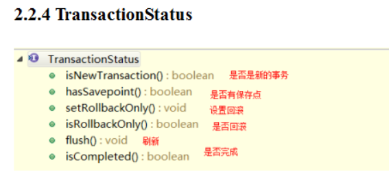
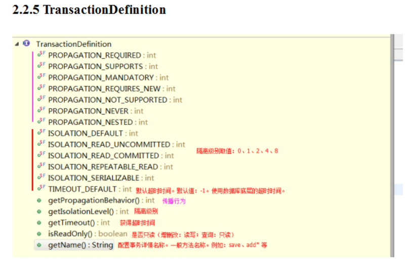

# 事务

一组业务操作CRUD,要么全部成功，要么全部失败

**特性：ACID**

- 原子性：整体
- 一致性：完整
- 隔离性：并发
- 持久性：结果


**隔离问题：**

- 脏读：一个事务读到另一个事务没有提交的数据
- 不可重复读：一个事务读到另一个事务已经提交的数据（update）
- 虚读（幻读）：一个事务读到另一个事务已经提交的数据(insert)

**隔离级别：**

- read uncommitted:读未提交， 存在3个问题
- read committed:读已提交，解决脏读，存在2个问题
- repeatable read:可重复读，解决脏读，不可重复读，存在一个问题
- serializable:串行化。都解决，单事务

**三个顶级接口：**

- `PlatformTransactionManager` :平台事务管理器，Spring要管理事务，必须要使用事务管理器进行事务配置时必须配置事务管理器

  常见的事务管理器

  - DataSourceTransactionManager ，jdbc开发时事务管理器，采用JdbcTemplate
  - HibernateTransactionManager，hibernate开发时事务管理器，整合hibernate

  api详解

  - TransactionStatus getTransaction(TransactionDefinition definition) ，事务管理器 通过“事务详情”，获得“事务状态”，从而管理事务。
  - void commit(TransactionStatus status) 根据状态提交
  - void rollback(TransactionStatus status) 根据状态回滚

- `TransactionStatus` :事务状态， Spring用于记录当前事务的运行状态，例如：是否有保存点，事务是否完成。

  

- `TransactionDefinition` : 事务详情（事务定义，事务属性） Spring用于确定事务具体详情的，例如：隔离级别、是否只读、超时时间等进行事务配置时必须配置详情。Spring将配置项封装到该对象实例。

  

  传播行为：在两个业务之间如何共享事务。

  - PROPAGATION_REQUIRED , required , 必须 【默认值】

    支持当前事务，A如果有事务，B将使用该事务。如果A没有事务，B将创建一个新的事务。

  - PROPAGATION_SUPPORTS ，supports ，支持。支持当前事务，A如果有事务，B将使用该事务。如果A没有事务，B将以非事务执行。

  - PROPAGATION_MANDATORY，mandatory ，强制。支持当前事务，A如果有事务，B将使用该事务。如果A没有事务，B将抛异常。

  - PROPAGATION_REQUIRES_NEW ， requires_new ，必须新的。如果A有事务，将A的事务挂起，B创建一个新的事务如果A没有事务，B创建一个新的事务

  - PROPAGATION_NOT_SUPPORTED ，not_supported ,不支持。如果A有事务，将A的事务挂起，B将以非事务执行。如果A没有事务，B将以非事务执行

  - PROPAGATION_NEVER ，never，从不。如果A有事务，B将抛异常。如果A没有事务，B将以非事务执行

  - PROPAGATION_NESTED ，nested ，嵌套。A和B底层采用保存点机制，形成嵌套事务。

  掌握：PROPAGATION_REQUIRED、PROPAGATION_REQUIRES_NEW、PROPAGATION_NESTED

Spring 底层根据状态进行相应操作

**mysql 事务操作--简单**

```java
// ABCD 一个事务 
Connection conn = null; 
try{ 
    //1 获得连接 conn = ...; 
    //2 开启事务 conn.setAutoCommit(false); 
    A;
    B;
    C;
    D; 
    //3 提交事务 conn.commit(); 
} catche(){ 
    //4 回滚事务 conn.rollback(); 
}
```

**mysql 事务操作--Savepoint**

```java
//需求：AB（必须），CD（可选） 
Connection conn = null; 
Savepoint savepoint = null; //保存点，记录操作的当前位置，之后可以回滚到指定的位置。（可以回滚一部分） 
try{ 
    //1 获得连接 conn = ...; 
    //2 开启事务
    conn.setAutoCommit(false); 
    A; 
    B;
    savepoint = conn.setSavepoint(); 
    C;
    D;
    //3 提交事务 conn.commit(); 
} catche(){ 
    if(savepoint != null){ 
        //CD异常 
        // 回滚到CD之前 
        conn.rollback(savepoint); 
        // 提交AB 
        conn.commit(); 
    } else{ 
        //AB异常 
        // 回滚AB 
        conn.rollback(); 
    } 
}
```

