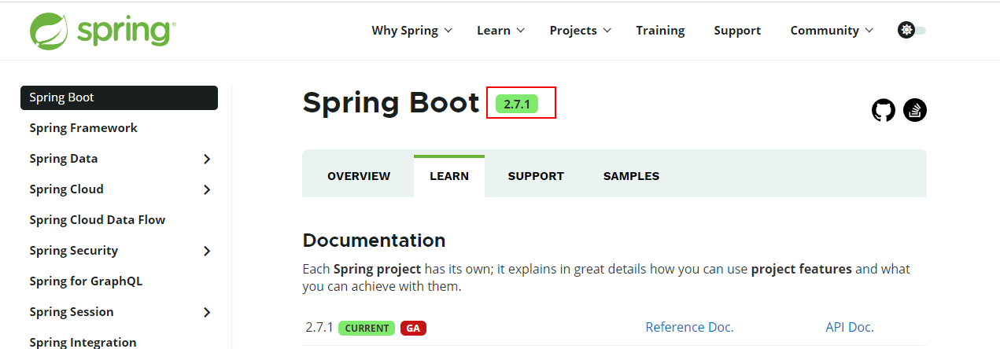

# Spring
Spring全家桶

SpringBoot笔记： https://www.yuque.com/atguigu/springboot/oovrhy

SpringBoot 2.4.0 版本web模块默认规则： https://blog.csdn.net/qq_43240702/article/details/111032361

SpringBoot 官网地址，可查看最新稳定版本 https://spring.io/projects/spring-boot#learn

GA表示稳定版，截图说明当前最新的稳定版本是 2.7.1

